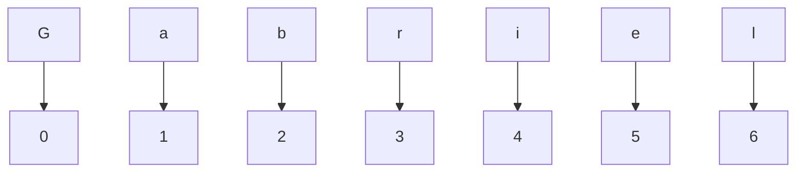
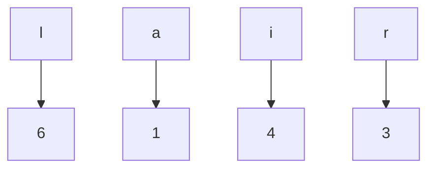

<h1 align="center"> <strike>Des</strike>Criptografador  </h1>

 Eu criei este programa após assistir um documentário sobre os romanos e como eles desenvolveram a criptografia
para comunicarem-se através do império sem que os inimigos caso capturassem as suas mensagens pudessem saber os seus planos.

 Inicialmente eu precisava dos caracteres da tabela ASCII, então eu os peguei deste site: https://web.fe.up.pt/~ee96100/projecto/Tabela%20ascii.htm. Eu retirei alguns caracteres desnecessários e então os intregrei em uma variável chamada "alphabet" dentro do arquivo <b>script.js</b>. Logo após eu criei o <b>index.html</b> e inseri alguns componentes do <b>bootstrap 4.4</b>. O mais importante é o <b>TextArea</b>. Este componente é basicamente um input gigante. Ótimo para este projeto pois o usuário pode inserir um texto grande e redimensionar o <b>TextArea</b> de acordo com a sua necessidade. Existem dois TextAreas: um para o texto a ser <b>criptografado</b> e o outro para o texto a ser <b>descriptografado</b>. Também existem dois <b>buttons</b> onde tem uma função para cada.

 O funcionamento deste programa é bem simples. Digamos que nós temos uma string <b>nome</b> com o valor "Gabriel". Cada caractere está alocado em um espaço de memória e pode ser consultado usando <b>índices</b>. Para mostrarmos apenas o primeiro caractere será dessa forma: nome[0]. Mas por que "0"?. Strings são alocadas nos seguintes espaços da seguinte forma:

 

 Caso eu queria acessar apenas as letras <b>l, a, i</b> e <b>r</b> (nesta ordem) será assim: nome[6], nome[1], nome[4], nome[3]

          

 Pois é justamente isso que as <b>estruturas condicionais for</b> nas <b>linhas 26</b> e <b>37</b>. É corrido a string de ponta a ponta e cada caractere...CONTINUAR

